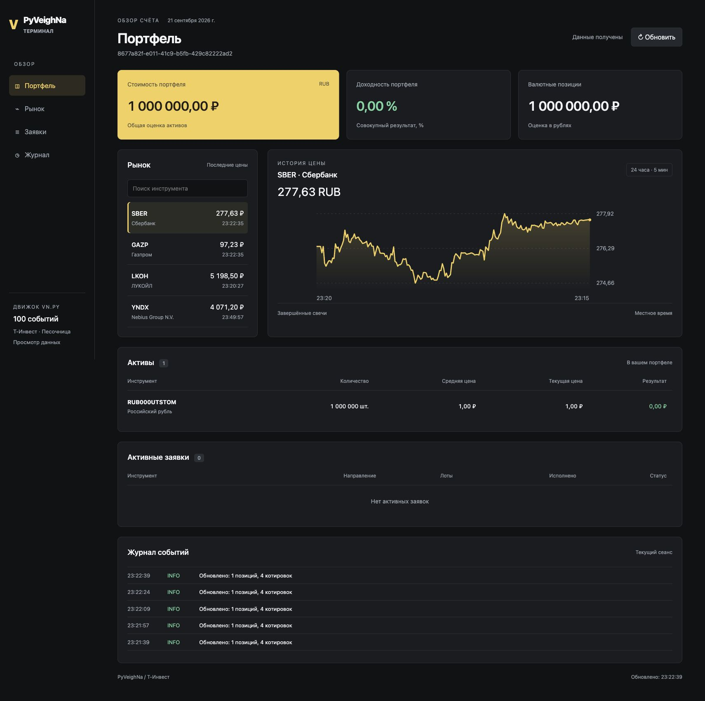

# Takt

Веб-терминал на Python: **Т-Инвест API + vn.py + HTML/CSS/JavaScript**.
Портфель, котировки, график цены, активные заявки и журнал на одной странице.
Адаптивный интерфейс с тёмной темой работает в браузере; прежний интерфейс PySide6 доступен отдельно.



*Текущий веб-интерфейс в режиме песочницы: тестовый счёт с 1 000 000 виртуальных ₽,
котировки и история цены SBER. Снимок сделан 21 сентября 2026 года.*

## Запуск

Нужны Python 3.10–3.13, Git и [uv](https://docs.astral.sh/uv/). Проверено на macOS ARM64 с Python 3.10.

```bash
uv sync --extra dev
uv run pyveighna --port 3729
```

Откройте [localhost:3729](http://localhost:3729) в браузере. Веб-интерфейс запускается по умолчанию; прежнее окно Qt доступно с `--desktop`.

Запуск с токеном песочницы и уже открытым тестовым счётом:

```bash
uv run takt --mode sandbox --port 3729
```

Для чтения настоящего счёта используйте `--mode readonly` и соответствующий токен.

Сервер слушает только локальный адрес. Токен остаётся в Python и не передаётся браузеру.
Портфель, котировки, график, поиск, заявки и журнал обновляются автоматически.
Ошибка подключения отображается в интерфейсе; демоданные вместо данных счёта не подставляются.

Без изменения `INVEST_MODE` используется **деморежим**, токен не нужен. Цены и портфель
смоделированы. Qt устанавливается вместе с vn.py; первая установка может загрузить
несколько сотен мегабайт. Данные деморежима сбрасываются при перезапуске.

В PyCharm выберите интерпретатор `.venv/bin/python` и запускайте модуль `pyveighna`
с рабочей директорией корня проекта. На Windows интерпретатор — `.venv/Scripts/python.exe`.

## Подключение Т-Инвест

1. Скопируйте `.env.example` в `.env` в корне проекта.
2. Вставьте свой токен в `TINKOFF_TOKEN`. Токен хранится только локально,
   `.env` исключён из Git. Для настоящего счёта используйте токен только для чтения.
3. Установите `INVEST_MODE=sandbox` для песочницы или `INVEST_MODE=readonly`
   для просмотра настоящего счёта.
4. При нескольких счетах задайте `TINKOFF_ACCOUNT_ID`. Без него выбирается
   первый открытый счёт. Неверный ID приводит к ошибке, а не к смене счёта.
5. Запустите `uv run takt`.

Песочница должна уже содержать открытый счёт. Приложение не создаёт счета,
не пополняет их и не отправляет/отменяет заявки ни в одном режиме.
Для реальных API-вызовов нужны действующий токен и доступ к API брокера.

Режим можно переопределить при запуске:

```bash
uv run takt --mode demo
uv run takt --mode sandbox
uv run takt --mode readonly
```

| Настройка | Значение |
| --- | --- |
| `INVEST_MODE` | `demo`, `sandbox`, `readonly`; по умолчанию `demo` |
| `TINKOFF_TOKEN` | Токен выбранного контура |
| `TINKOFF_ACCOUNT_ID` | Необязательный ID открытого счёта |
| `INVEST_FIGIS` | 1–20 FIGI через запятую; по умолчанию SBER, GAZP, LKOH, YNDX (Nebius) |
| `INVEST_POLL_SECONDS` | Интервал опроса, 5–3600 секунд; по умолчанию 15 |

## Что показывает интерфейс

- **Стоимость портфеля** — `total_amount_portfolio` брокера в RUB.
- **Доходность** — `expected_yield` портфеля в процентах, не дневное изменение.
- **Валютные позиции** — их суммарная оценка в RUB, а не доступный для вывода остаток.
- **Позиции** — количество в штуках, средняя и текущая цена, результат в валюте позиции.
  Для облигаций цены берутся из денежных значений портфеля; котировки API в списке
  наблюдения могут иметь другую единицу (например, проценты номинала). По умолчанию
  список наблюдения содержит только акции.
- **Список наблюдения** — последние цены и время цены по API, поиск по тикеру/названию.
  Старое время цены возможно при закрытом рынке; время успешного опроса — отдельно внизу.
- **График** — закрытия завершённых пятиминутных свечей за последние 24 часа.
  Выбор строки меняет инструмент; история обновляется примерно раз в минуту и кнопкой ↻.
  На выходных и без торгов график может быть пустым. Время отображается в часовом поясе компьютера.
- **Активные заявки** — заявки выбранного счёта, полученные от брокера; статусы и направления
  сохранены в обозначениях SDK. Демо-заявки не создаются.
- **Журнал** — последние 300 событий текущего сеанса. Ошибки соединения не стирают
  предыдущий портфель, но интерфейс отмечает данные как устаревшие. Повторный опрос автоматический.

## Интеграция с vn.py

```text
Т-Инвест gRPC (sandbox / readonly) / DemoProvider
                 ↓ фоновый поток, последовательные запросы
            InvestmentEngine
                 ↓ Event + TickData
          vn.py EventEngine
                 ↓ состояние, история и журнал
         Локальный HTTP API :3729
                 ↓ JSON / опрос браузером
          Веб-интерфейс портфеля
```

Используются настоящие `vnpy.event.EventEngine` и `vnpy.trader.object.TickData`:
каждая котировка публикуется как `EVENT_TICK`, портфель и история — как пользовательские
события. FIGI используется как символ с `Exchange.LOCAL`: это внутренний идентификатор,
а не утверждение о площадке исполнения. Счётчик событий слева позволяет видеть работу движка.

Это мониторинг и основа для дальнейшей разработки: здесь нет торгового gateway
`BaseGateway` для `MainEngine`, автоматических стратегий, бэктестов или исполнения сделок.
Токен не передаётся в UI и маскируется в сообщениях об ошибках. Все RPC имеют deadline
12 секунд. Веб-сервер останавливается через `Ctrl+C` в терминале; закрытие вкладки
не прекращает фоновое обновление. Текущий RPC при остановке может завершаться до deadline.

Файлы:

```text
takt/config.py      настройки и валидация
takt/models.py      модели и точные денежные значения Decimal
takt/providers.py   демо и чтение Tinkoff API
takt/rpc.py         ограничение времени запросов
takt/transport.py   TLS и подключение к актуальным адресам Т-Инвест
takt/certs/         корневой сертификат для соединения с брокером
takt/engine.py      фоновые задачи и события vn.py
takt/webserver.py   локальный HTTP API и фоновое обновление
takt/web/           веб-интерфейс, график и таблицы
takt/ui.py          прежний интерфейс Qt (--desktop)
tests/                  тесты адаптера, движка и UI
uv.lock                 зафиксированные зависимости
```

## Проверки

```bash
uv run pytest -q
```

Тесты проверяют денежную точность, расчёты демо, чтение SDK с подменой сети, выбор счёта,
ошибки, deadline, события настоящего vn.py, поиск/выбор инструмента и обновление UI.
Тесты также проверяют HTTP API, защиту локального сервера и настройку TLS.
Тесты не отправляют запросы с настоящим токеном.

Скриншот веб-интерфейса в начале README находится в `docs/screenshots/web-overview.jpg`.
Для его обновления запустите приложение, дождитесь загрузки котировок и графика
и сохраните полноэкранный снимок страницы браузера.

Параметр `--screenshot` относится только к прежнему интерфейсу Qt и всегда включает деморежим:

```bash
QT_QPA_PLATFORM=offscreen uv run takt --screenshot docs/screenshots/overview.png
```

## Особенности зависимостей

Запрошенный [Tinkoff/invest-python](https://github.com/Tinkoff/invest-python) архивирован.
SDK закреплён на коммите `1cc84950266d62cd0bc7a43ad764dddfd4252630` (0.2.0b59).
Его служебная зависимость `tinkoff==0.1.1` отсутствовала в доступном реестре при сборке.
Настройка `tool.uv.override-dependencies` исключает этот namespace-пакет;
`tinkoff.invest` устанавливается из SDK и использует native namespace Python 3.
Поэтому используйте **uv sync**, а не обычный `pip install .`.

[vn.py](https://github.com/vnpy/vnpy) закреплён на 4.2.0.
Получение портфеля, котировок и истории проверено с API песочницы Т-Инвест.
Доступность операций чтения на настоящем счёте зависит от токена и его прав.

## TLS для Т-Инвест

Подключение использует актуальные адреса `invest-public-api.tbank.ru:443`
и `sandbox-invest-public-api.tbank.ru:443`. Для этих gRPC-каналов явно указан
официальный Russian Trusted Root CA из `takt/certs/`.
Проверка цепочки, срока действия и имени сервера остаётся включённой.
Установка сертификата в macOS и отключение TLS-проверки не нужны.
Источник и SHA-256 сертификата записаны в `takt/certs/README.md`.
